<H1  style="text-align:center"> E-Banking Web Application </H1>
<H3>- Table Of All Customers</H3>
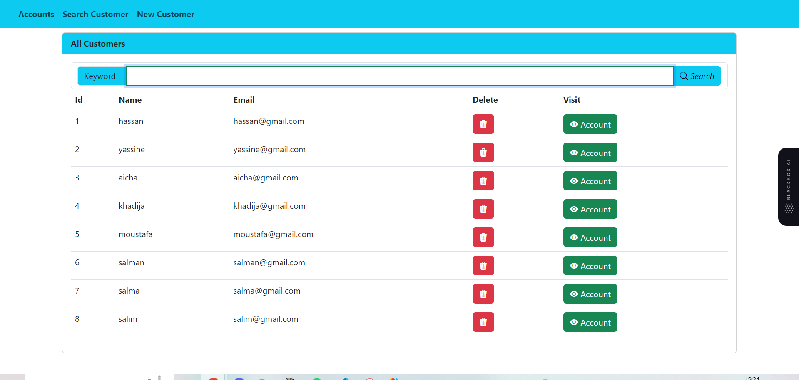
<H3>- Search Customers </H3>
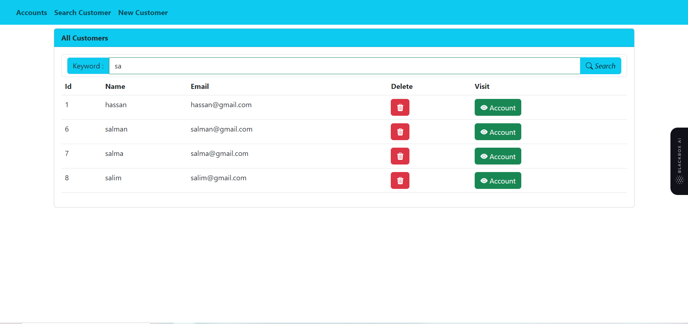
<H3>- Add New Customer</H3>
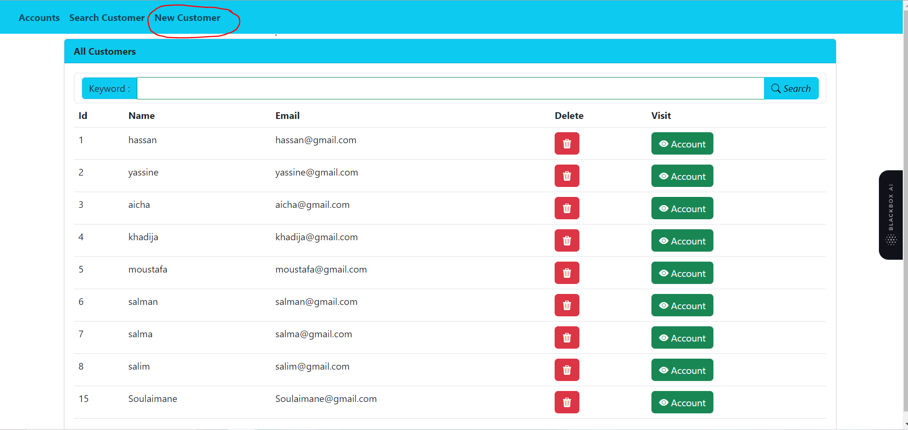
<H3>- Save The New Customer </H3>
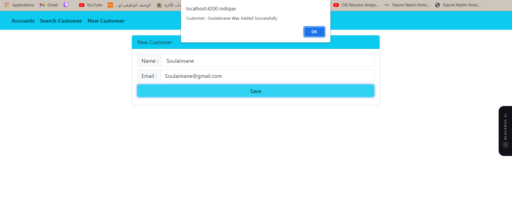
<H3>- Customer Added Successfully</H3>
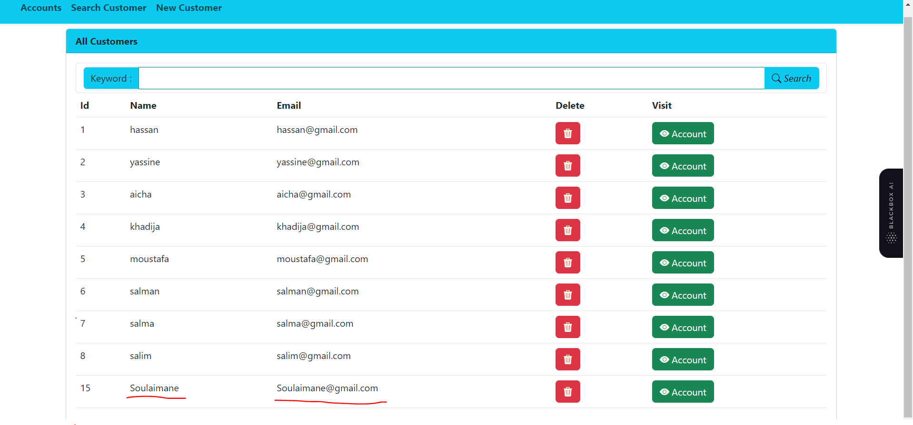
<H3>- Delete Customer</H3>
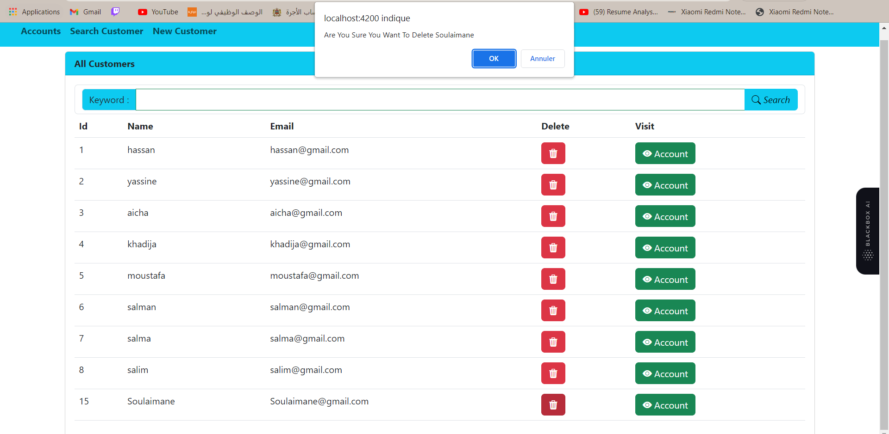
<H3>- Customer Deleted Successfully</H3>
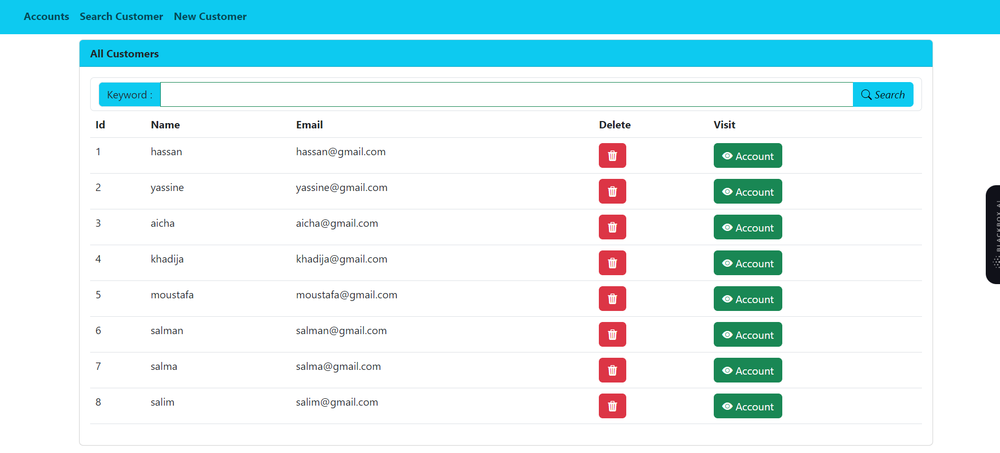
<H3>- Visit Accounts Per Customer </H3>
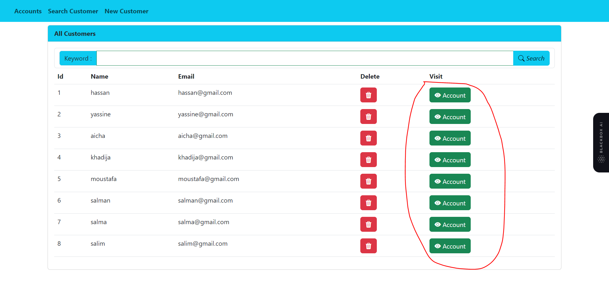
<H3>- Accounts For Customer Number 4 </H3>
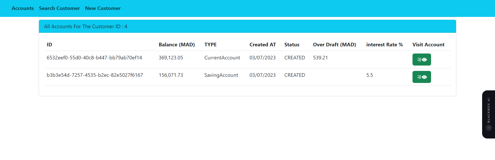
<H3>- Visit Account</H3>
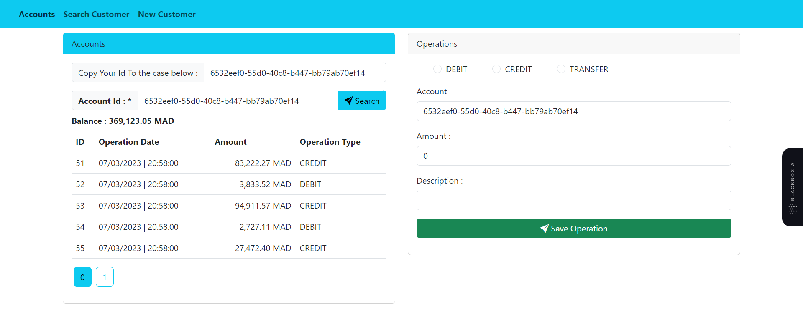
<h2 style="text-align:center">- Do some Operations :</h2>
<H3>- Before Debit</H3>
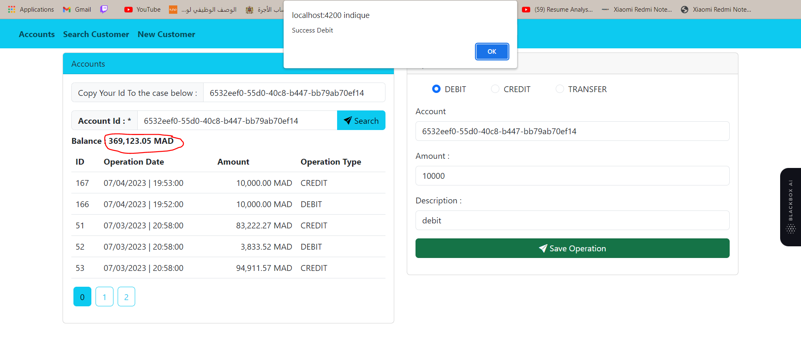
<H3 >- After Debit</H3>
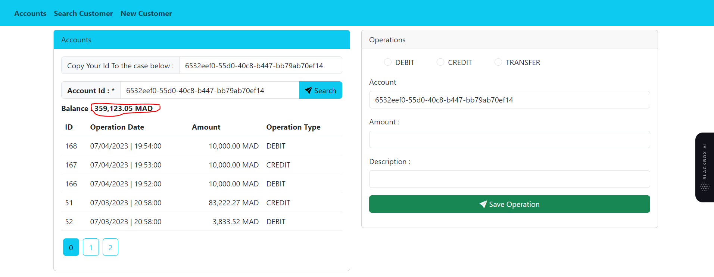
<H3>- Before Credit</H3>
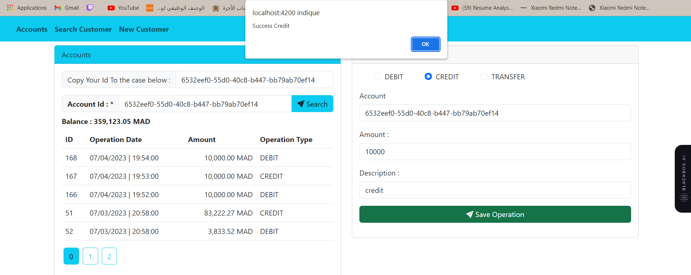
<H3 >- After Credit</H3>
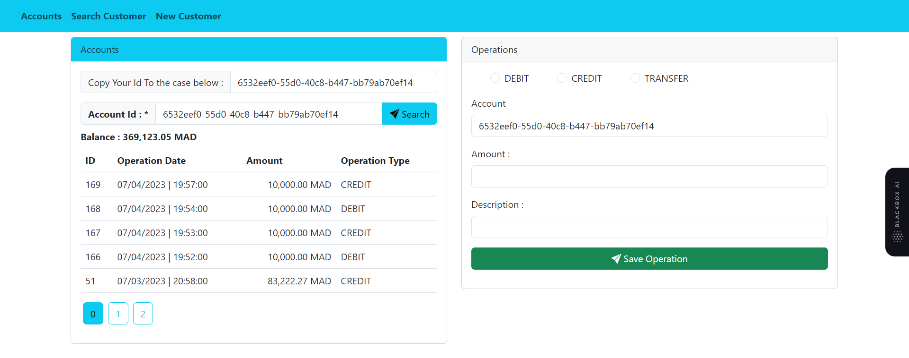
<H3>- Before Transfer</H3>
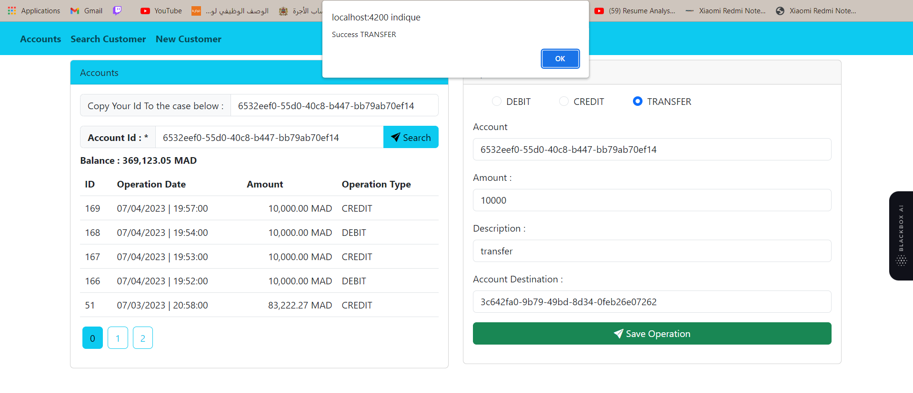
<H3 >- After Transfer</H3>
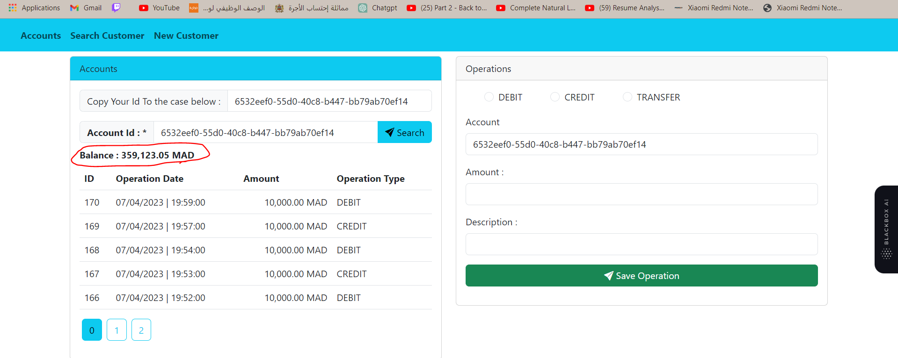
<H3 >- Pagination</H3>

<H3 >- We Can Also Visit Accounts Directly </H3>
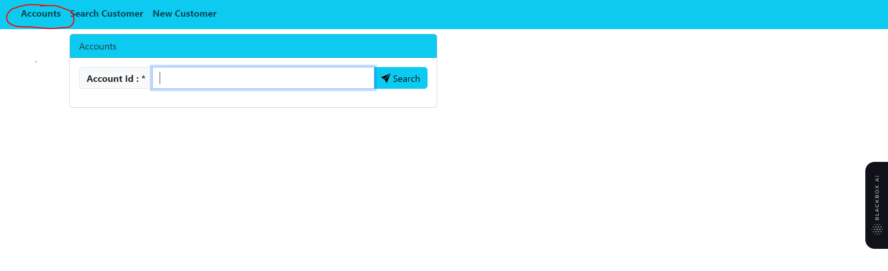
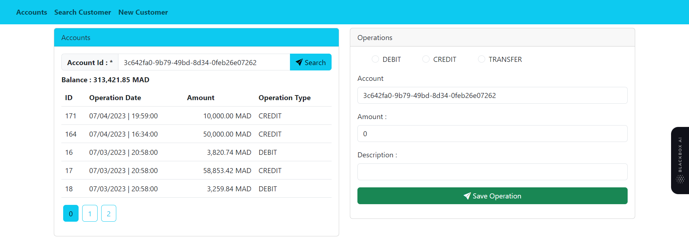
